# House Price Prediction — Full App Demo

This demo runs a small web app that predicts house prices using a machine-learning
model. You'll start everything with **one command** and open it in your browser.
---

## What you're running

The app is made of a few small pieces that talk to each other:

- **Frontend** — the web page you see and type into (port **4000**)
- **Backend** — receives your input and forwards it (port **4001**)
- **AI Model Service** — runs the ML model and returns a price (port **4002**)
- **MLflow Server** — stores the trained model (port **5000**, started by the *other* project)

The flow looks like this:



You open the page → it sends your house details to the backend → the backend asks the
AI service → the AI service uses the model (loaded once from MLflow) → the price comes
back to your screen.

---

## ⚠️ Step 0 — Start the MLflow project FIRST (required)

The AI model service needs the **MLflow server** to get the model. That server lives in a
**different project** and must be running **before** you start this one.

Open a terminal, go to the **tracking-ml-model-experiments** folder, and start it:

```
cd path/to/tracking-ml-model-experiments
docker compose up -d
```

Leave it running. (If you haven't registered a model there yet, follow that project's
README to train and register the model first — this app needs a model to serve.)

---

## Step 1 — Open a terminal in THIS project folder

Navigate to the folder that contains this project's `docker-compose.yml`:
```
cd path/to/this-project
```

---

## Step 2 — Start the app

Run **one** command:
```
docker compose up --build
```

What this does:
- downloads and builds the app pieces (first time is slow — this is normal),
- starts all the services,
- shows their logs in the terminal.

Wait until the logs settle and you see the services running. **Leave this terminal open** —
closing it stops the app.

> First run downloads a lot. Later runs are fast.

---

## Step 3 — Open the app in your browser

Go to:
```
http://localhost:4000
```

If you're opening it from **another computer** on the same network, use the server
machine's IP instead of `localhost`:
```
http://<server-ip>:4000
```

Enter house details, submit, and you'll get a predicted price.

---

## Step 5 — (Optional) See the pieces directly

Each service is reachable on its own port:

- **The app (frontend):** http://localhost:4000
- **AI model service API docs (Swagger):** http://localhost:4002/docs
  — try the `/predict` endpoint here directly.
- **MLflow (from the other project):** http://localhost:5000
  — see the registered model and experiments.

---

## Step 6 — Stop the app

In the terminal running the app, press:
```
Ctrl + C
```
Then, to fully clean up:
```
docker compose down
```
(Do the same in the tracking-ml-model-experiments folder when you're finished with it.)

---

## If something doesn't work

- **Page won't load at :4000** — is `docker compose up` still running in the terminal?
  Check the logs there for errors.
- **You get a prediction error** — the AI service probably can't reach MLflow. Make sure
  **Step 0** is done: the tracking-ml-model-experiments project is running and a model is
  registered as `@champion`.
- **"Port already in use"** — something else is using 4000/4001/4002/5000. Stop it, or ask
  the instructor.
- **Check a service's logs:**
  ```
  docker compose logs ai-model-service
  ```
- **Opening from another PC fails** — use the server's IP (not `localhost`), and make sure
  you're on the same network.

---

## The one idea to take away

The website never talks to the model directly. It talks to an **API** (the AI model service),
which loaded the model **once at startup** from **MLflow**. Each piece has one job, and they
communicate over simple web requests — that's how real ML systems are put together.